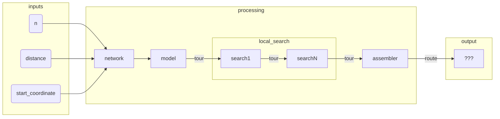

# running-routes (backend)

## Installation
The backend is heavily dependant on open-source geospatial libraries that can be difficult to [install](https://geopandas.org/getting_started/install.html#dependencies). However, if you use Ubuntu, the dependencies can be installed via:
```
sudo add-apt-repository ppa:ubuntugis/ppa
sudo apt update
sudo apt install libspatialindex-dev gdal-bin
```
Install the the latest version of the backend:
```
pip install -e git+https://github.com/btang164/running-routes#egg=pkg&subdirectory=backend
```

## CLI
If you want five 3km routes around [Melbourne central](https://goo.gl/maps/rRwXExFbXnYx85U87)
```
poetry run running_routes \
    --distance 3000 \
    --n 5 \
    --lat -37.80960885346664 \
    --lng 144.96323726880522
```

## Semantics
| Word | Definition | Example |
|---|---|---|
| `distance` | Maximum distance covered in a route|3000|
| `n`| The number of running routes| 5|
| `start_coordinate` | Coordinate (lat, lng) where all routes start and stop | `[-37.80960885346664, 144.96323726880522]`|
|`node`| Network analogue to a lat-long coordinate | 0
|`start_node`| Network analogue of `start_coordinate`| 0
|`tour`| A list of nodes that start and end at `start_coordinate` |`[0, 1, 0]`
|`tours`| Array of length `n` where each element is a `tour`|`[[0, 1, 0], [0, 2, 0]]`
|`routes`| Lat-long representation of `tours` - May contain route metadata| `[[[1, 1], ..., [1, 1]]]`
|`length`| The distance, in meters, between two adjacent nodes| 5 |


## Pipeline design
